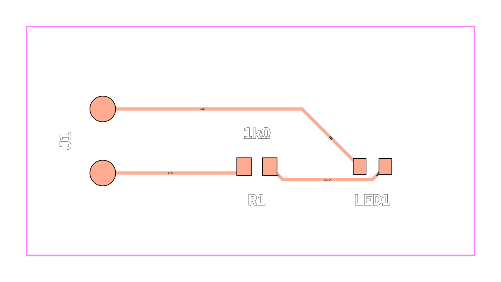
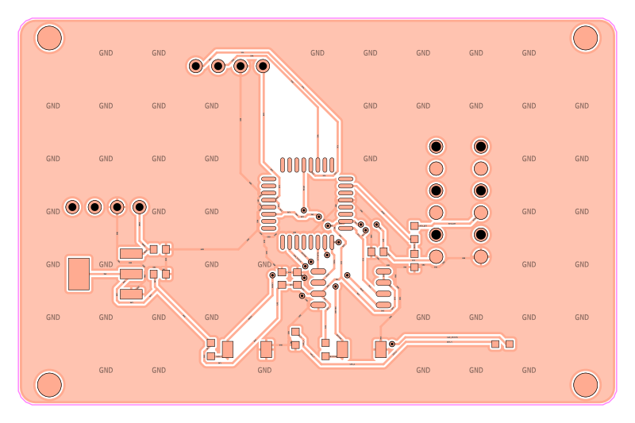

# EasyEDA Copilot Contributions

Status: Working EDA automation / active open-source contributions

I built and tested an EasyEDA automation toolchain, then moved the strongest improvements into contributions for [EasyEDA Copilot](https://github.com/biosshot/easyeda-copilot), an open-source project that connects AI assistants to EasyEDA Pro through MCP tools.

My work focuses on making the integration safer and more useful against real EasyEDA project state: incomplete document trees, linked-board cleanup, component-library search, long-running script control, and verification that tool calls did what they claimed.

## Open Pull Requests

I currently have four contributions under review in the upstream BioShot repository.

### Project Tree Null Safety

[PR #63: Tolerate incomplete board links](https://github.com/biosshot/easyeda-copilot/pull/63)

I reproduced a failure in EasyEDA Pro 3.2.149 where a board could temporarily expose only one linked document. I changed project serialization so a missing schematic or PCB link no longer causes the entire project read to fail, and added the current project UUID to the response.

Verification included 81 extension tests, two new regression cases, compilation, focused linting, and a live check against the project state that originally triggered the failure.

### Safer Board Deletion

[PR #64: Delete linked board documents safely](https://github.com/biosshot/easyeda-copilot/pull/64)

I changed board deletion so the linked schematic and PCB are removed before the board container. Each deletion is checked against EasyEDA's document inventory, and partial failures preserve enough project structure for cleanup to be retried instead of leaving orphaned documents.

Verification included 82 extension tests and three new regressions covering ordered cleanup, partial failure, and EasyEDA automatically removing an empty board.

### Full Library Search

[PR #65: Search all EasyEDA library sections](https://github.com/biosshot/easyeda-copilot/pull/65)

I extended `component_search` beyond LCSC lookup so it can query EasyEDA's System, Recent, Personal, Project, Public, Standard Edition Public, Favorite, and LCSC sections. The tool can return devices, footprints, and panel libraries while reporting results and errors per section.

I tested the change against EasyEDA Pro 3.2.149 and received live results from System, Personal, Project, Public, Standard Edition Public, and LCSC libraries. The extension test suite, MCP type checks, project checks, and focused linting also passed.

### Cooperative Script Interruption

[PR #66: Add cooperative `execute_js` interruption](https://github.com/biosshot/easyeda-copilot/pull/66)

I added an MCP interruption tool for long-running `execute_js` calls. The request bypasses the normal serialized EasyEDA command queue, while scripts receive a cooperative control object with cancellation state, an execution ID, and a helper for stopping between units of work.

Cancellation is cooperative: it can stop at safe checkpoints, but it cannot preempt synchronous JavaScript or an EasyEDA API call that has not returned. I added controller, registration, and transport coverage and ran the extension and MCP validation commands.

## Earlier PCB Automation Work

Before moving my work upstream, I used a customized EasyEDA Copilot setup to explore a larger agent-driven PCB workflow. I connected EasyEDA Pro Desktop to Codex-style agents and local Ollama models, then experimented with:

- reading the active project and document state
- resolving parts and applying schematic changes
- generating and updating PCB layouts
- routing and design-rule checks
- compact MCP outputs for smaller local models
- active-tab inference for linked schematic and PCB documents
- release gates, smoke tests, EasyEDA log inspection, and manufacturing-image checks

That work helped me identify the smaller, testable improvements represented by the upstream pull requests. It also reinforced that EDA automation needs to verify editor state instead of treating a successful-looking text response as proof that a design operation worked.

## Visual Outputs

These images came from my earlier board-preview and manufacturing-QA experiments.

## Engineering Work

- Connected MCP tools to EasyEDA's project, board, schematic, PCB, and component-library APIs.
- Reproduced editor failures and turned them into focused regression tests.
- Kept destructive document operations retryable after partial failure.
- Added cooperative cancellation without claiming the runtime can stop synchronous work.
- Split the work into focused pull requests for upstream review.

## Current Direction

I am no longer developing a separate EasyEDA copilot. My current work happens in my [EasyEDA Copilot fork](https://github.com/carter-howell/easyeda-copilot), with focused pull requests submitted to the [BioShot upstream project](https://github.com/biosshot/easyeda-copilot).

The four pull requests above are open and under review. I will update this showcase as contributions are revised, merged, or followed by additional work.
